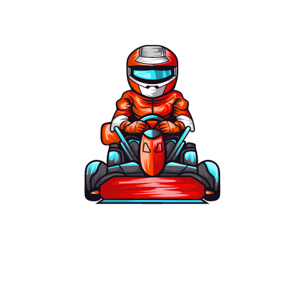

# Zack Cinal Project

 # Title:  

# Race Week

## Description: 

>>My project will be about F1. Webpage is going to include these: 

>>> News
  
>>> Current championship standings

>>> About next race(Track info with layout)

>>> History of F1

## Wireframes: 
>[Check Figma here](https://www.figma.com/file/64ZWfz7wqRVLwrPAEuADgi/Untitled?type=design&node-id=0%3A1&mode=design&t=kN1YdoH9lnh2vKqw-1)

 ## APIs: 

>F1 API => [Ergast](http://ergast.com/mrd/)

>WEATHER API => [Open Mateo](https://open-meteo.com/en/docs/)
      

## MVP: 
>I want a simple webpage that shows current data of standings and next race's info. Also in the news section I will add links to news' website. 

## Post MVP:
>I created the webpage as I wanted to, I also added some pictures of the current leaders in the championship and also added another API that shows current track tempareture of the next race. 